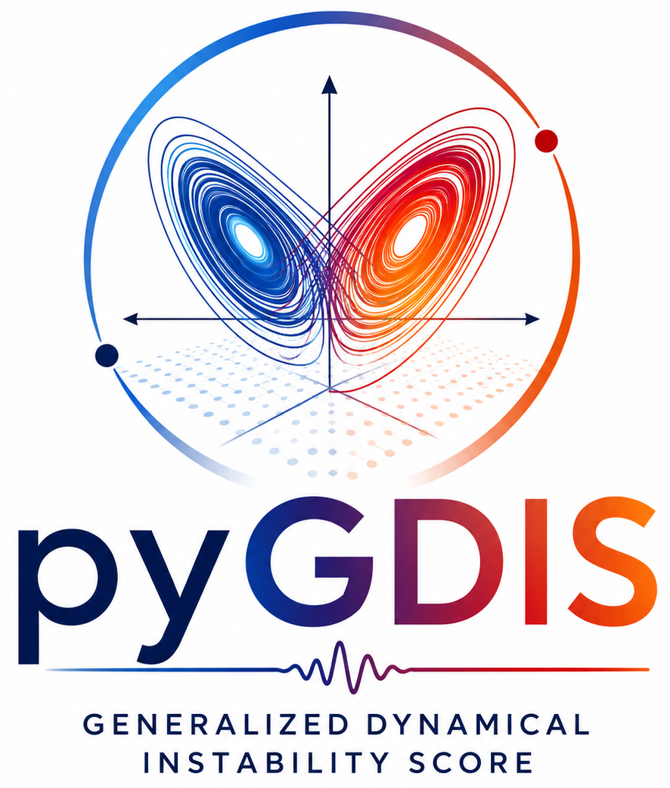
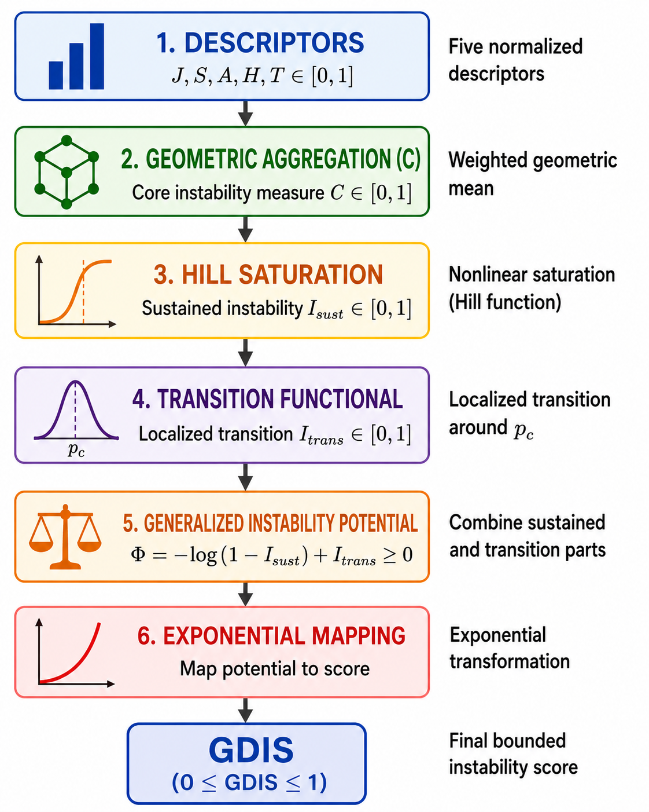

<p align="center">
  
</p>

# pyGDIS

[](https://github.com/hamiddi/pygdis/actions/workflows/tests.yml)
[](https://github.com/hamiddi/pygdis/actions/workflows/build.yml)
[](https://www.python.org/)
[](LICENSE)
[](CHANGELOG.md)

**pyGDIS** is the reference Python implementation of the **Generalized Dynamical Instability Score (GDIS)**, a descriptor-based framework for quantifying nonlinear instability and localized critical-transition behavior across parameter-ordered trajectory families.

The package implements the formulation used in the accompanying manuscript and separates reusable scientific software from paper-specific benchmarking and plotting code.

## Why GDIS?

Conventional measures often emphasize one manifestation of nonlinear behavior. GDIS combines complementary channels within a bounded and interpretable architecture.

| Measure | Primary emphasis | Bounded cross-system score | Localized transition term |
|---|---|:---:|:---:|
| Lyapunov exponent / FTLE | Perturbation divergence | No | No |
| Entropy measures | Informational complexity | Often | No |
| Recurrence measures | Recurrence geometry | Depends | Indirect |
| **GDIS** | Dynamical, geometric, informational, and temporal evidence | **Yes** | **Yes** |

GDIS is intended to complement—not replace—established nonlinear-dynamics tools.

## Mathematical formulation

The reference implementation computes five descriptors:

- `J`: local dynamical sensitivity
- `S`: trajectory stretching
- `A`: attractor expansion
- `H`: nonlinear complexity
- `T`: temporal persistence

The principal descriptors are aggregated through a weighted geometric mean,

$$
C = \left(\widetilde J^{\alpha_J}\widetilde S^{\alpha_S}\widetilde A^{\alpha_A}\right)^{1/(\alpha_J+\alpha_S+\alpha_A)},
$$

with reference exponents

$$
\alpha_J=0.42,\qquad \alpha_S=0.33,\qquad \alpha_A=0.25.
$$

After complexity and persistence modulation and Hill saturation, the sustained-instability functional is combined with an unweighted transition-localization term through

$$
\Phi = -\ln(1-I_{\mathrm{sustained}}) + \lambda_t I_{\mathrm{transition,base}},
$$

followed by

$$
\mathrm{GDIS}=1-e^{-\Phi},\qquad 0\leq \mathrm{GDIS}<1.
$$

The default reference value is `lambda_t = 0.18`.

<p align="center">
  
</p>

## Mathematical properties

The implementation preserves the properties established in the manuscript:

- **Boundedness:** `0 <= GDIS < 1`.
- **Monotonicity:** increasing sustained or transition instability cannot decrease GDIS.
- **Baseline preservation:** when the transition term is zero, GDIS equals the sustained-instability functional.
- **Robust scale handling:** percentile normalization is invariant to positive affine transformations of its input descriptor.

## Installation

```bash
python -m pip install pygdis
```

For development:

```bash
git clone https://github.com/hamiddi/pygdis.git
cd pygdis
python -m pip install -e ".[dev]"
pytest
```

## Quick start

```python
from gdis import GDIS
from gdis.benchmarks import LorenzSystem

system = LorenzSystem()
trajectories, parameters = system.generate_sweep()

result = GDIS().fit_transform(
    trajectories,
    parameters,
    jacobian_function=system.jacobian,
    critical_value=system.critical_value,
)

print(result.to_dataframe().head())
result.plot()
```

### Data-only use

When an analytical Jacobian is unavailable, omit `jacobian_function`. pyGDIS uses a trajectory-based local-divergence proxy.

```python
result = GDIS().fit_transform(trajectories, parameters)
```

If `critical_value` is omitted, the reference implementation centers the transition-localization window at the maximum transition-energy estimate and records this choice in `result.metadata`.

### Analyze trajectory data from CSV

The repository includes a complete long-format example dataset at
[`examples/synthetic_parameter_sweep.csv`](examples/synthetic_parameter_sweep.csv).
Each row contains a control parameter, time, and two observed state variables:

```text
parameter,time,x1,x2
0.000000,0.000000,...,...
0.000000,0.100334,...,...
```

Run the included end-to-end analysis:

```bash
cd examples
python csv_data_example.py
```

The script creates `gdis_results/` beside the CSV file.

The script loads and groups the CSV into parameter-ordered trajectories, computes
GDIS in data-only mode, and writes:

- `gdis_results.csv` with the final score, potential, functionals, and descriptors;
- `gdis_profile.png`;
- `gdis_components.png`; and
- `analysis_summary.txt`.

To analyze a user-supplied file:

```bash
python csv_data_example.py \
  --input my_data.csv \
  --parameter-column load \
  --time-column time \
  --state-columns voltage angle
```

See [CSV analysis in the usage guide](docs/USAGE.md#analyzing-long-format-csv-data) for the required format and interpretation of outputs.

## Package organization

```text
src/gdis/
├── components.py       # J, S, A, H, and T descriptors
├── scaling.py          # robust normalization and saturation
├── transition.py       # transition energy and localization
├── potential.py        # Phi and bounded GDIS mapping
├── score.py            # reference end-to-end GDIS estimator
├── sensitivity.py      # transition-weight rescoring
├── validation.py       # optional validation metrics
├── plotting.py         # reusable plotting helpers
├── benchmarks/         # canonical benchmark access
└── systems/            # Lorenz, Rössler, Chen, and logistic systems
```

Paper-specific workflows are intentionally isolated under `examples/publication/` and are not imported by the core package.

## Reproducing the manuscript analyses

```bash
python scripts/reproduce_paper.py
```

Or run the stages separately:

```bash
python examples/publication/reproduce_benchmarks_and_sensitivity.py
python examples/publication/reproduce_publication_figures.py
```

These scripts reproduce the canonical benchmark sweep, transition-weight sensitivity analysis, validation tables, attractor galleries, and publication figures. They are research-reproduction workflows rather than core API modules.

## Transition-weight sensitivity

A completed result can be rescored without recomputing trajectories or descriptors:

```python
from gdis import transition_weight_sensitivity

sensitivity = transition_weight_sensitivity(
    result,
    weights=(0.0, 0.18, 0.25, 0.50, 0.75, 1.0),
)
```

## Documentation

- [Installation](docs/INSTALLATION.md)
- [Usage](docs/USAGE.md)
- [Mathematics](docs/MATHEMATICS.md)
- [API](docs/API.md)
- [Applications](docs/APPLICATIONS.md)

## Companion manuscript

**Generalized Dynamical Instability Score (GDIS): A Universal Framework for Quantifying Instability and Critical Transitions in Nonlinear Dynamical Systems**

The manuscript is being submitted to *IEEE Access*. Publication metadata and DOI will be added after acceptance. Supplementary material accompanies the manuscript.

## Citation

Until the journal article is published, cite the software repository using [`CITATION.cff`](CITATION.cff). A temporary BibTeX entry is:

```bibtex
@software{ismail_pygdis_2026,
  author  = {Ismail, Hamid D. and Harb, Ahmad and Bikdash, Marwan},
  title   = {pyGDIS: Generalized Dynamical Instability Score},
  year    = {2026},
  version = {1.0.0},
  url     = {https://github.com/hamiddi/pygdis}
}
```

## Scope and interpretation

This release implements the manuscript's **reference formulation**. The descriptor set, weighting strategy, and transition-localization method are modular and may be extended for application-specific studies. The current benchmark evidence supports broad cross-system applicability; it is not an exhaustive empirical proof over every nonlinear system.

## Contributing and license

Contributions are welcome; see [CONTRIBUTING.md](CONTRIBUTING.md). pyGDIS is distributed under the [MIT License](LICENSE).
